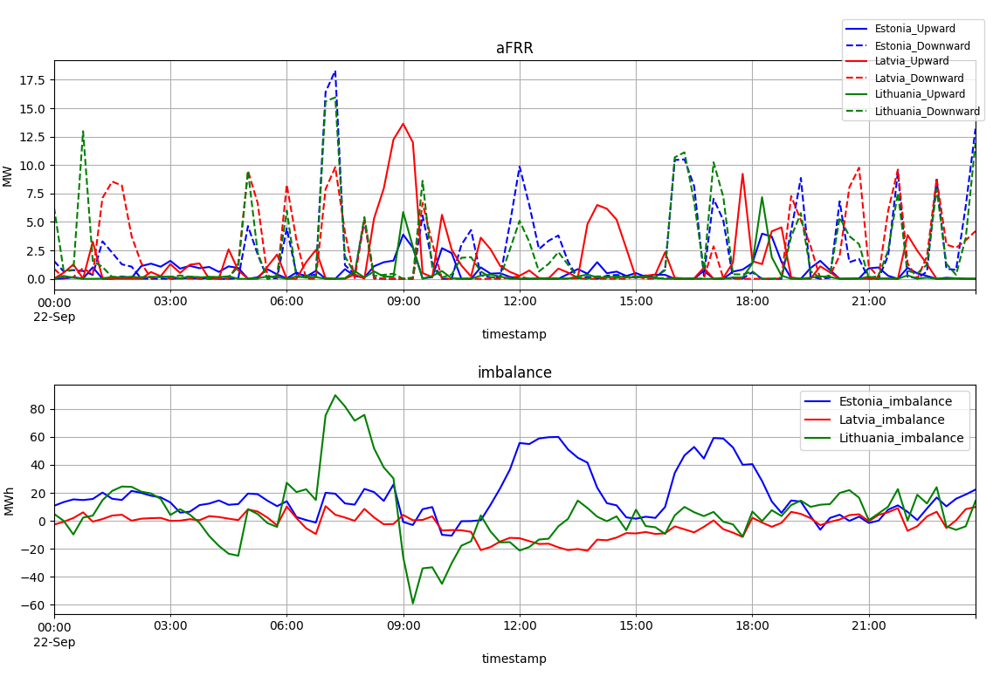
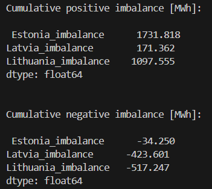
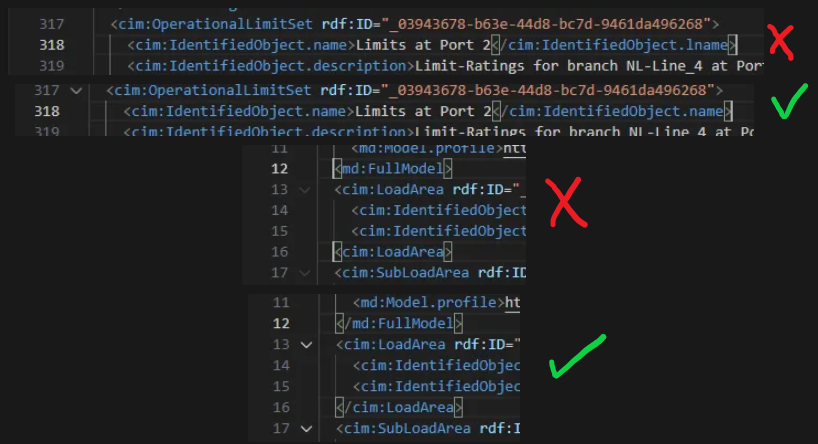

# README

Solutions for the test tasks, by Kevin Räpo

Task 1 was solved in a regular python file, for task2 `Jupyter` seemed like the right tool, I am a big fan of Jupyter since the formatting capabilities there are very useful for such displays of text/code mix.

If there is a desire to test these tasks locally, both the pip compatible `requirements.txt` and conda compatible `environment.yaml` are provided.

##  Task 1

If running task 1, it should be launched from the subfolder, not the top-level folder, to avoid confusion with the working directory (when running from the top-level folder in VS Code, the data folder is created at the top level).

### Summary

1.	Make a graph and additional metrics to support the assessment of the amount of activation of aFRR reserves in relation to the imbalance. Provide also reasoning and background for the assessment.

It can be seen that this day is much more down activation heavy, Estonias inbalances were mostly positive during the day with a large positive cumulative sum at the end of they. Latvia was more balanced around the 0 line, with a negative sum at the end of they, and Lithhuania was also down activation heavy, with a positive imbalance sum at the end of the day. 

One interesting observation here is that Estonias and Lithuanias aFRR down activations were about the same at the end of the day, eventhough Estonias imbalance was 3x higher at the end of the day.

---

## Task 2

Some of the questions are further expanded on in the Jupyter Notebook file.

### Summary

1.	**What is the total production capacity of the generators in the model? What is each generating unit power factor?**

  - Max production capacity: 1500 kW, each unit has a power factor of 0.9.

2.	**What kind of regulation control generator NL-G1 has? Why this and do you know any other kinds?**

    - Voltage regulated, this works by adjusting the reactive power provided
    - Examples of other kind of control are: active power, reactive power and power factor.

3.	**What are the nominal voltages of the windings of the transformer NL_TR2_2 (ID: _2184f365-8cd5-4b5d-8a28-9d68603bb6a4)? What type of transformer is this in the grid?**
  - High end: 220 kV, low end - 15.75 kV.
  - This is a two winding step-up transformer

4.	**What is permanently allowed limit for line segment NL-Line_5 (ID: _e8acf6b6-99cb-45ad-b8dc-16c7866a4ddc) and temporarily allowed. What is difference between those limits. List other types of limits in the grid**

  - Temporary is the limit allowed for a short duration while under critical condition. Permament is the regularly allowed line limit.
5.	**Which generator is set as slack in the model? Why does model need slack node?**
  - My conclusion from the available information is that the slack generator could not be determined from this model. My research yielded that either the "AngleRefTopologicalNode" or "referencePriority" is needed for this evaluation, both of which are missing from this model. Maybe there is another way to determine this from the model but I could not indentify it.
  - The slack node is used as a reference point for the power system and to balance out active and reactive power in the system.

6.	**Find mistakes in the model (both semantic, power system related and logical errors are present)**

  #### Semantic
  To get the file running first some xml definitions needed to be fixed
  - Missmatch of some opening and closing tags
  
  - Line 678, 701 and 724 had the same ID for the "PowerTransformerEnd", which is not allowed, changed the ID endings so every ID was unique.

  #### Power system/logic related
  - Missing "baseVoltage" elements for all the windings
  - Swapped PATL/TATL values
  - Missing slack generator definition

